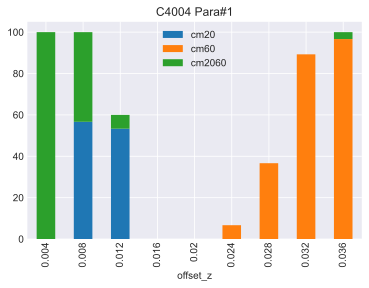

# 1. DOE 불량율 계산

## 1.1. 파일설명

### 1.1.1. AA 공정 로그파일

    파일명이 "BA"로 시작하고 파일명 중간에 "AA"가 포함되어 있는 파일
    모듈 ID는 SensorID

### 1.1.2. EOL 공정 로그파일

    파일명이 "BA"로 시작하고 파일명 중간에 "LAS"가 포함되어 있는 파일
    모듈 ID는 Tx_ASIC_ID
    파일명에 C로 시작해서 번호 4개 즉 CXXXX가 해당 모듈의 컨피그이다

## 1.2. SPEC 파일

    SUMMARY_LOG_FORMAT.csv
    스펙 파일의 각 ROW에는 스펙 이름과 거기에 해당하는 lower_limit과 upper_limit이 있다.
    "sfr_20cm"과 "sfr_60cm" 문구가 포함된 스팩 항목 중 Lower / Upper Limit이 비어있지 않은 항목만 사용한다.  

## 1.3. 문제

각각의 모듈은 AA 과정을 거치게 되는데 AA 로그에서 문제와 관련된 아이템은 SensorID, site, offset_z 이다. EOL공정을 거치고 나서는 EOL로그가 남는데 Tx_ASIC_ID, moduleconfig, SPEC 파일에 있는 측정 항목들이 남는다.

로그분석을 통해 아래와 같은 형태로 CSV 파일로 쓰면 되는데 cm20, cm60은 각 "sfr_20cm","sfr_60cm" 문자열이 포함된 스펙 항목의 failure rate을 의미한다. cm2060은 20cm와 60cm 모두 fail된 모듈의 failure rate이다. cm20, cm60, cm2060 각 불량율은 서로 exclusive 하고 세개 불량율은 합은  해당 그룹의 총 불량율이 된다. (20cm만불량, 60cm만불량, 20cm와 60cm 모두불량)

failre rate은 같은 conifg, site, offset_z 그룹 별로 계산된다.
count는 해당 그룹의 총 갯수를 의미한다.

| moduleconfig |  site  | offset_z | count |    cm20     | cm60  |   cm2060    |
| :----------: | :----: | :------: | :---: | :---------: | :---: | :---------: |
|    C4004     | Para#1 |  0.004   |  29   |      0      |   0   |     100     |
|    C4004     | Para#1 |  0.008   |  30   | 56.66666667 |   0   | 43.33333333 |
|    C4004     | Para#1 |  0.012   |  30   | 53.33333333 |   0   | 6.666666667 |
|    C4004     | Para#1 |  0.016   |  30   |      0      |   0   |      0      |
|    C4004     | Para#1 |   0.02   |  30   |      0      |   0   |      0      |

## 1.4. 주의사항

- 컨피그 정보는 EOL로그에 포함되어 있지만 부정확한 정보입니다. EOL로그의 파일이름에 나와있는 컨피그 정보를 사용하세요.
- 로그에서 중복된 모듈아이디가 존재하는 경우 가장 최근의 데이터를 사용합니다.
- EOL로그의 특정 모듈이 AA에서 어떤 site와 offset_z을 사용 했는지를 알기위해서 AA로그의 SensorID와 EOL 로그의 Tx_ASIC_ID를 매칭하여 찾아야 합니다.

출력 파일은 아래와 같이 나오도록 작성하세오.

[report.csv](report.csv)

# 2. 보너스

시간이 된다면 아래와 같은 stacked bar plot을 출력해 보세요

